<p align="center">
  
</p>

<h1 align="center">LicenseDesk</h1>

<p align="center">
  <strong>Система учёта нематериальных активов</strong><br>
  Лицензии, подписки, сертификаты — всё в одном месте
</p>

<p align="center">
  
  
  
  
  
  
</p>

---

## Возможности

- **Учёт активов** — управление лицензиями, подписками и сертификатами с привязкой к организациям и проектам
- **История стоимости** — автоматическое отслеживание изменений стоимости и валюты
- **Платежи** — учёт платежей, автоматический расчёт даты следующего платежа (фиксированный и плавающий периоды)
- **Инвойсы** — прикрепление документов к платежам с хранением в S3-совместимом хранилище
- **Уведомления** — настраиваемые напоминания о предстоящих платежах
- **Архивирование** — мягкое удаление активов с возможностью восстановления
- **Экспорт** — выгрузка в Excel с учётом фильтров и поиска
- **Справочники** — организации, проекты, типы активов с конструктором полей, валюты, периоды продления
- **Управление доступом** — роли (Администратор, Менеджер, Наблюдатель) с привязкой к организациям/проектам
- **Аудит** — полный журнал действий с фильтрацией по дате, пользователю, типу операции
- **Профиль пользователя** — аватар, личные данные, смена пароля
- **SSO** — интеграция с Keycloak (OIDC)

## Стек технологий

| Компонент | Технологии |
|-----------|-----------|
| **Backend** | Python 3.12, FastAPI, SQLAlchemy 2.0, Alembic, Pydantic v2, Celery |
| **Frontend** | React 19, TypeScript 5.7, Ant Design 5, Vite 6 |
| **База данных** | PostgreSQL 16 |
| **Кэш/очередь** | Redis 7 |
| **Хранилище файлов** | MinIO / AWS S3 |
| **Аутентификация** | JWT, Keycloak (OIDC) |

## Скриншоты

<details>
<summary>Развернуть</summary>

### Вход
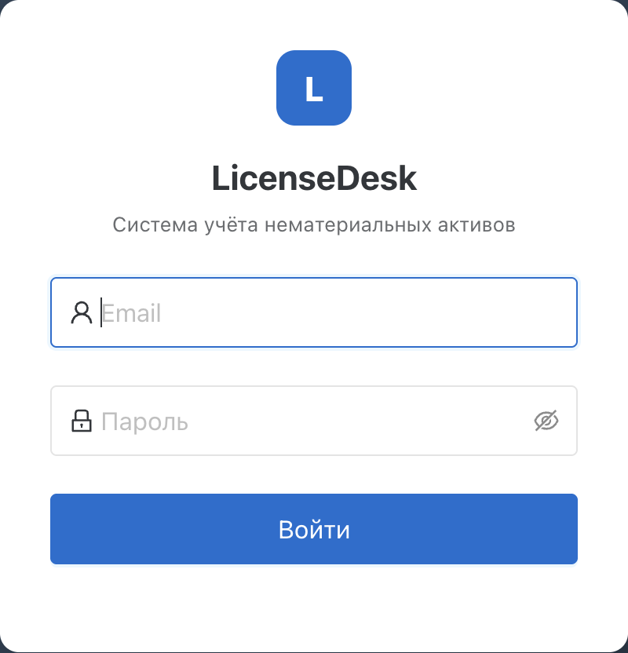

### Текущие активы
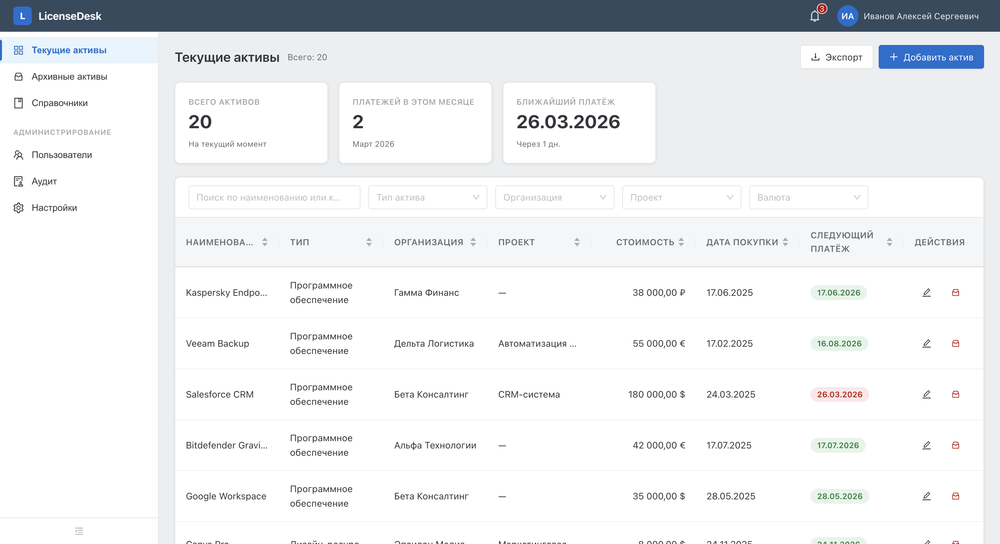

### Карточка актива
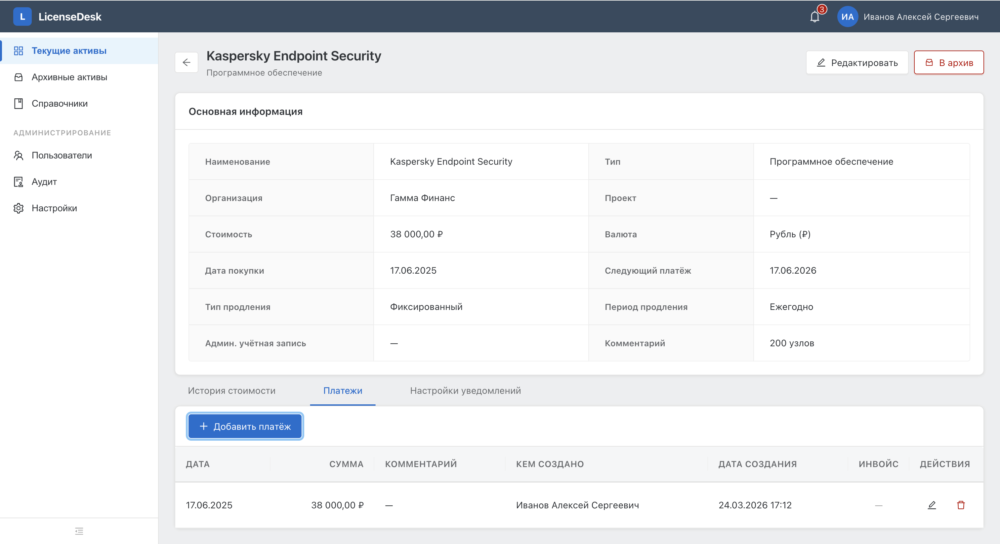

### Архивные активы
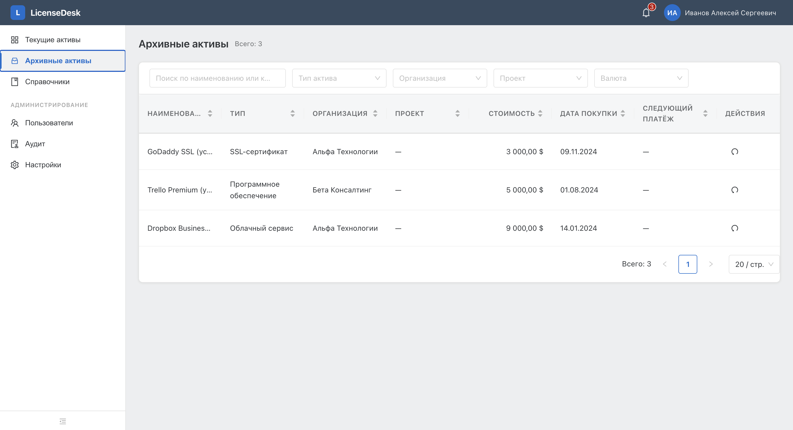

### Справочники
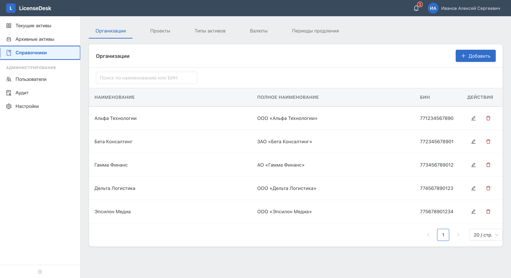

### Пользователи
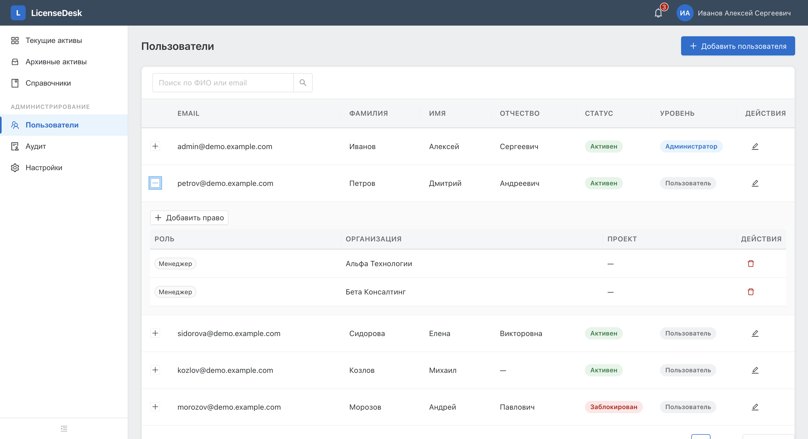

### Журнал аудита
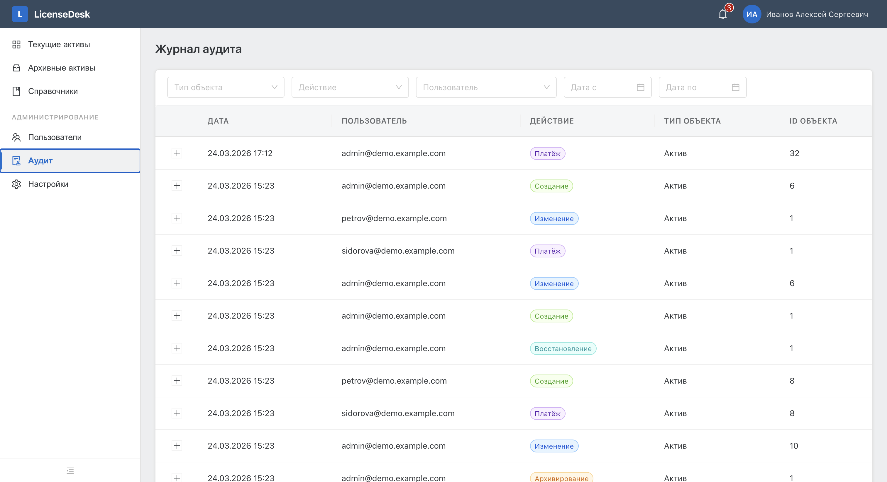

### Уведомления
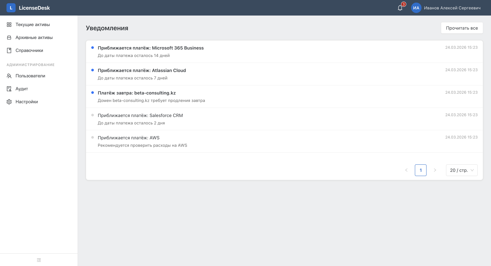

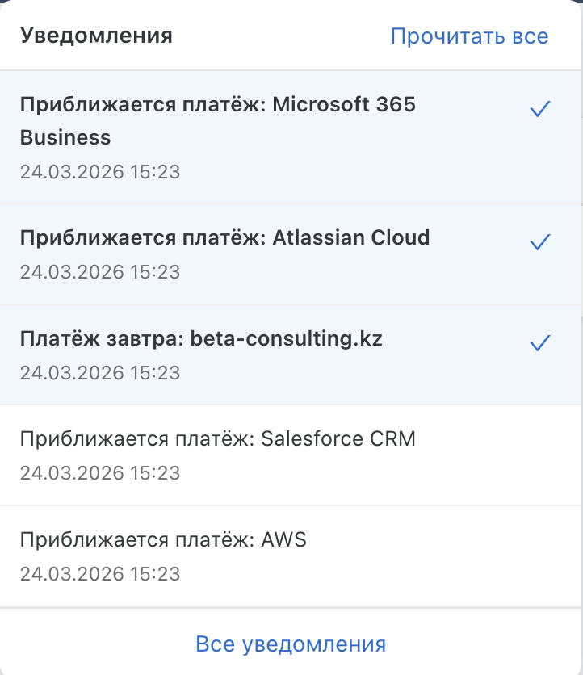

### Профиль пользователя
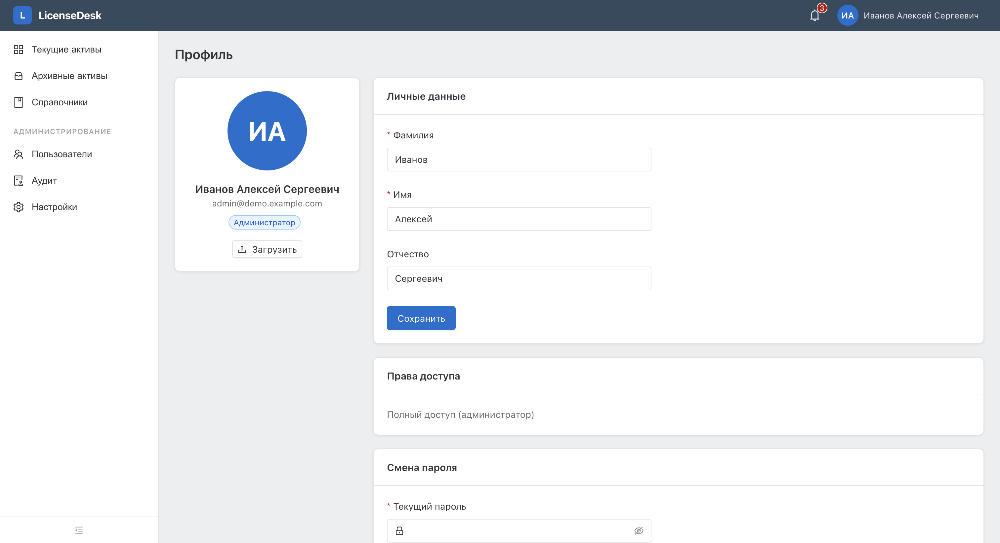

### Настройки
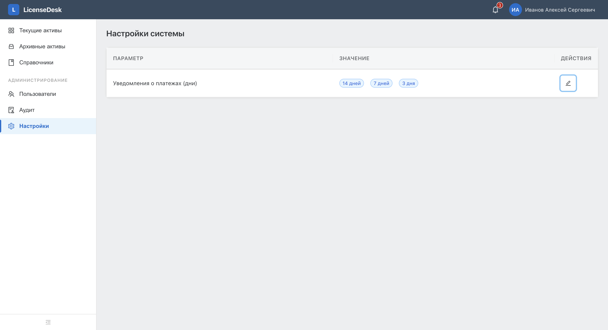

</details>

## Быстрый старт

### Демо с тестовыми данными

```bash
git clone https://github.com/your-username/license-desk.git
cd license-desk
make demo
```

Это создаст 5 организаций, 10 проектов, 35 активов, платежи, историю стоимости, уведомления и аудит.

| Сервис | URL |
|--------|-----|
| **Фронтенд** | http://localhost:5173 |
| **Swagger** | http://localhost:8000/docs |
| **MinIO Console** | http://localhost:9001 |

| Роль | Логин | Пароль |
|------|-------|--------|
| Администратор | admin@demo.example.com | admin |
| Менеджер | petrov@demo.example.com | demo |
| Наблюдатель | kozlov@demo.example.com | demo |

### Демо с Keycloak SSO

```bash
make demo-keycloak
```

Дополнительно поднимает Keycloak с настроенным realm `license-desk`, клиентом и демо-пользователями. Вход через SSO доступен на странице логина.

| Сервис | URL |
|--------|-----|
| **Keycloak Console** | http://localhost:8080 (admin / admin) |

### Остановка

```bash
make down           # остановить все сервисы
make down && docker compose down -v  # остановить и удалить данные
```

### Docker (чистый запуск)

```bash
git clone https://github.com/your-username/license-desk.git
cd license-desk

# Запуск всех сервисов
docker compose up -d

# Применение миграций
docker compose exec backend alembic -c migrations/alembic.ini upgrade head

# Создание администратора
docker compose exec backend python -m scripts.create_default_user
```

### Локальная разработка

```bash
# Зависимости инфраструктуры
docker compose up -d postgres redis minio
docker compose run --rm minio-init

# Backend
cd backend
python3.12 -m venv .venv
source .venv/bin/activate
pip install -e ".[dev]" python-multipart boto3
cp ../.env.example .env  # настроить при необходимости
alembic -c migrations/alembic.ini upgrade head
python -m scripts.create_default_user
uvicorn app.main:app --reload --port 8000

# Frontend (в отдельном терминале)
cd frontend
npm install
npm run dev
```

Подробные инструкции: [docs/deployment.md](docs/deployment.md)

## Структура проекта

```
license-desk/
├── backend/
│   ├── app/
│   │   ├── main.py              # FastAPI приложение
│   │   ├── config.py            # Конфигурация (pydantic-settings)
│   │   ├── dependencies.py      # DI: авторизация, права
│   │   ├── core/                # Инфраструктура (БД, JWT, аудит, хранилище)
│   │   ├── models/              # SQLAlchemy модели
│   │   ├── domains/             # Бизнес-логика по доменам
│   │   │   ├── auth/            # Аутентификация, профиль
│   │   │   ├── assets/          # Активы, платежи, история
│   │   │   ├── references/      # Справочники
│   │   │   ├── users/           # Управление пользователями
│   │   │   ├── notifications/   # Уведомления
│   │   │   ├── audit/           # Журнал аудита
│   │   │   ├── export/          # Экспорт в Excel
│   │   │   └── settings/        # Системные настройки
│   │   └── tasks/               # Celery задачи
│   └── migrations/              # Alembic миграции
├── frontend/
│   └── src/
│       ├── api/                 # HTTP-клиент и типы
│       ├── auth/                # Контекст авторизации
│       ├── components/          # Layout, NotificationBell
│       ├── pages/               # Страницы приложения
│       └── styles/              # Глобальные стили
├── docker/                      # Скрипты инициализации
├── docs/                        # Документация и ADR
├── docker-compose.yml
├── Makefile
└── .env.example
```

## Конфигурация

Все переменные окружения имеют префикс `LICENSEDESK_`. См. [.env.example](.env.example).

| Переменная | По умолчанию | Описание |
|---|---|---|
| `DATABASE_URL` | — | PostgreSQL (asyncpg) |
| `REDIS_URL` | — | Redis |
| `SECRET_KEY` | — | Ключ для JWT |
| `S3_ENABLED` | `false` | Включить S3 хранилище |
| `S3_ENDPOINT_URL` | — | URL эндпоинта (MinIO/AWS) |
| `S3_BUCKET` | `licensedesk` | Имя бакета |
| `SMTP_ENABLED` | `false` | Email уведомления |
| `KEYCLOAK_ENABLED` | `false` | SSO через Keycloak |

## Makefile команды

```bash
make demo             # Демо с тестовыми данными
make demo-keycloak    # Демо с Keycloak SSO
make up               # Запуск в фоне
make down             # Остановка всех сервисов
make logs             # Логи всех сервисов
make dev              # Запуск в Docker с пересборкой
make setup            # Миграции + создание админа
make dev-backend      # Локальный запуск бэкенда
make dev-frontend     # Локальный запуск фронтенда
make test             # Тесты
make lint             # Проверка стиля
make format           # Автоформатирование
make migrate          # Применить миграции
make migrate-create msg="описание"  # Создать миграцию
```

### Windows (без make)

`make` недоступен на Windows по умолчанию. Используйте команды напрямую:

```powershell
# Демо с тестовыми данными
docker compose up -d --build
timeout 8
docker compose run --rm minio-init
docker compose exec backend alembic -c migrations/alembic.ini upgrade head
docker compose exec backend python -m scripts.seed_demo_data

# Остановка
docker compose down

# Остановка с удалением данных
docker compose down -v
```

Альтернативно: установите `make` через [Chocolatey](https://chocolatey.org/) (`choco install make`) или используйте [WSL](https://learn.microsoft.com/en-us/windows/wsl/).

## Роли и права

| Роль | Активы | Справочники | Пользователи | Аудит | Настройки |
|------|--------|-------------|--------------|-------|-----------|
| **Администратор** | Полный доступ | Полный доступ | Полный доступ | Полный доступ | Полный доступ |
| **Менеджер** | CRUD | CRUD | Просмотр + права (manager/viewer) | Просмотр | — |
| **Наблюдатель** | Только чтение | Только чтение | — | — | — |

## Лицензия

[MIT](LICENSE)
